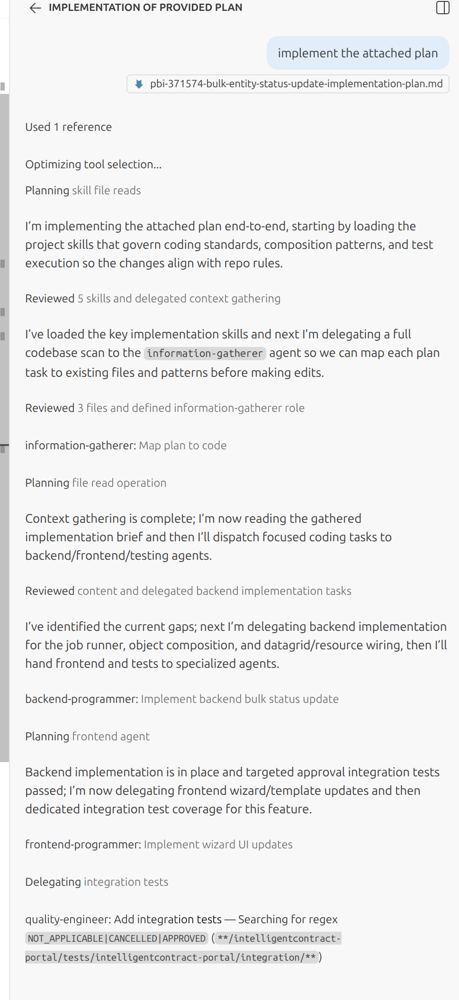

README NEEDS UPDATING

# Orchestra

Orchestra is a VS Code Copilot multi-agent workflow kit for planning, researching, implementing, refining, and validating software changes through coordinated specialist agents.

It is built for work that is too broad or too context-heavy for a single prompt. Instead of asking one agent to do everything, Orchestra gives you an orchestrator plus focused specialists for architecture, implementation, research, testing, review, UX, security, and product thinking.



## Current State

- Built around custom agents and prompt files installed into `.github/agents` and `.github/prompts`
- Currently intended for VS Code Insiders
- Relies heavily on subagent delegation, so the orchestrator carries the tool access required by its team
- Uses model placeholders that are resolved during installation

The default model lists currently live in:

- `code-models.txt` for technical agents
- `generic-models.txt` for coordination and strategy agents

## What You Get

### Agents

The repository currently ships these agents:

- `orchestrator` - coordinates work and delegates to the rest of the team
- `architect` - plans architecture and implementation approach
- `backend-api-programmer` - handles backend endpoints, controllers, middleware, request validation, and boundary response handling without running tests
- `backend-domain-programmer` - handles backend business logic, workflows, and server-side rules without running tests
- `backend-data-programmer` - handles schema, persistence, repositories, queries, and migrations without running tests
- `backend-integration-programmer` - handles external service integrations, jobs, adapters, and infrastructure-facing server code without running tests
- `backend-auth-programmer` - handles authentication, authorization, identity, sessions, tokens, and access-control flows without running tests
- `backend-platform-programmer` - handles application bootstrap, runtime configuration, feature flags, and observability or infrastructure wiring without running tests
- `frontend-ui-programmer` - handles components, screens, view composition, and interactive UI behavior without running tests
- `frontend-state-programmer` - handles client-side state, caching, synchronization, and data flow without running tests
- `frontend-forms-programmer` - handles forms, validation, submission flows, and multi-step data entry without running tests
- `frontend-styling-programmer` - handles styling, responsive layout, design system application, and visual polish without running tests
- `frontend-routing-programmer` - handles routing, navigation, app shell composition, URL state, and route guards without running tests
- `frontend-platform-programmer` - handles frontend bootstrap, runtime configuration, provider wiring, and platform setup without running tests
- `debugger` - investigates failures and isolates root causes
- `information-gatherer` - collects repository and GitHub context
- `judge` - determines whether a claim is true, false, or not established from submitted evidence and independent research
- `quality-engineer` - focuses on automated test coverage and test strategy
- `tester.cli` - runs CLI-based validation and interprets failures
- `tester.browser` - performs browser-based validation with Playwright
- `product-manager` - sharpens scope, value, and prioritization
- `security-expert` - reviews security risks and abuse cases
- `ux-designer` - reviews user-facing changes for clarity and usability
- `scribe` - handles straightforward documentation work
- `code-review.bugs` - reviews correctness and runtime behavior
- `code-review.naming` - reviews naming consistency
- `code-review.self-documenting` - reviews readability and intent clarity
- `code-review.simplify` - reviews unnecessary complexity, duplication, missed reuse, abstraction opportunities, and YAGNI risks
- `code-review.solid` - reviews SOLID design risks

### Prompts

The prompt set is built around both one-off utilities and a staged delivery pipeline:

- `orchestra.critique` - critique an attached file using the available review agents
- `orchestra.document` - generate a feature document grounded in real code
- `orchestra.learn` - extract a reusable lesson from the current chat into a skill
- `orchestra.stage0.refresh` - refresh existing Orchestra-generated skills
- `orchestra.stage1.import-spec` - turn a URL or freeform requirements into a normalized story
- `orchestra.stage2.research` - produce repository-grounded research documents for the story
- `orchestra.stage3.plan` - convert the story into an implementation plan with explicit task-level code review checkpoints
- `orchestra.stage4.refine` - refine the plan until critical and high issues are removed and review gates are strong enough to enforce technical excellence
- `orchestra.stage5.execute` - implement the refined plan while rerunning code review and validation throughout execution
- `orchestra.stage6.code-review` - run a recursive full-suite code review on the branch diff until every Orchestra code review agent returns `Go`
- `orchestra.stage7.merge-check` - run a recursive merge-readiness gate after stage 6 until the branch reaches `Go`

## Delivery Flow

The staged prompts are intended to build documents under `documents/<branch-name>/`.

Typical flow:

1. `orchestra.stage1.import-spec` writes `story.source.md` and `story.md`
2. `orchestra.stage2.research` writes one or more files under `research/`
3. `orchestra.stage3.plan` writes `plan.md`
4. `orchestra.stage4.refine` updates `plan.md` in place and hardens its review checkpoints
5. `orchestra.stage5.execute` writes `execution-report.md` with implementation, validation, and code review evidence
6. `orchestra.stage6.code-review` creates or updates `issues.md` while iterating until the full code review suite is `Go` on the latest diff
7. `orchestra.stage7.merge-check` uses the same diff-base discovery to run the final merge-blocking test and acceptance gate

This keeps planning, research, execution, and release validation in a predictable per-branch workspace.

## Repository Layout

- `agents/` - custom agent definitions copied into `.github/agents`
- `prompts/` - reusable prompt files copied into `.github/prompts`
- `prompts/orchestra.config/` - workflow configuration copied into `.github/prompts/orchestra.config`
- `prompts/orchestra.templates/` - staged workflow templates copied into `.github/prompts/orchestra.templates`
- `documents/` - generated per-branch output, with `.gitkeep` committed and generated contents gitignored
- `scripts/` - support scripts, including model placeholder substitution
- `install.sh` - installs Orchestra into the current repository's `.github` directory
- `uninstall.sh` - removes installed Orchestra agents, prompts, and skills

## Installation

### Prerequisites

- A repository root that contains both `.github/` and `ai/orchestra/`
- VS Code Insiders
- Custom agents enabled in your VS Code environment
- Chat subagents enabled: `chat.customAgentInSubagent.enabled`

You also need the supporting skills expected by the agents and prompts. At minimum, the current orchestrator expects:

- `run-tests`
- `playwright`

### Install Steps

1. Place this repository at `ai/orchestra` inside your project.
2. Review the available models in `code-models.txt` and `generic-models.txt`.
3. Optionally add environment-specific notes to `prompts/orchestra.config/manual-testing-instructions.md`.
4. From the project root, run:

```bash
./ai/orchestra/install.sh
```

The installer will:

- copy `agents/` into `.github/agents/`
- copy `prompts/` into `.github/prompts/`
- copy `prompts/orchestra.templates/` into `.github/prompts/orchestra.templates/`
- copy `prompts/orchestra.config/` into `.github/prompts/orchestra.config/`
- remove any previously installed Orchestra agent and prompt files first
- prompt you to choose models for technical and coordination agents
- replace `${CODE_MODEL}` and `${GENERIC_MODEL}` placeholders in the installed agent files

### Uninstall

From the project root, run:

```bash
./ai/orchestra/uninstall.sh
```

This removes installed Orchestra files from `.github/agents`, `.github/prompts`, and any Orchestra-prefixed skill directories under `.agents/skills` if that folder exists.

## Usage

### Orchestrator

Use the orchestrator agent as the main entry point for multi-step work:

```text
@orchestrator implement the attached plan
```

Use it when the work needs delegation, multiple specialist passes, or iterative review and validation.

For implementation routing, the orchestrator should pick the narrowest matching programmer by default and split cross-cutting work into explicit specialist-owned tasks. The dotted-family fan-out rule remains appropriate for review and tester families such as `code-review.*` and `tester.*`, but implementation specialists are intentionally shipped as singleton hyphenated agents so backend and frontend coding work stays segregated by lane rather than collapsing into a generalist path.

### Staged Factory Workflow

Example progression for a new piece of work:

```text
/orchestra.stage1.import-spec https://example.com/ticket/123
/orchestra.stage2.research
/orchestra.stage3.plan
/orchestra.stage4.refine
/orchestra.stage5.execute
/orchestra.stage6.code-review
/orchestra.stage7.merge-check
```

### Utility Prompts

Useful one-off prompts outside the full staged flow:

```text
/orchestra.critique
/orchestra.document describe the existing auth flow
/orchestra.learn capture the pattern we discovered in this session
```

## Configuration

### Model Selection

Technical and coordination agents use separate model pools during installation:

- `code-models.txt` feeds agents such as programmers, debugger, testers, and reviewers during install
- `generic-models.txt` feeds agents such as orchestrator and product-manager during install

The selected values are written into the installed copies in `.github/agents/`.

### Manual Testing Instructions

`prompts/orchestra.config/manual-testing-instructions.md` is an optional note file for browser and manual validation guidance. It is copied to `.github/prompts/orchestra.config/manual-testing-instructions.md`, which is the path the installed tester agents reference.

### Documents

Generated outputs belong under `documents/<branch-name>/`. The repository currently gitignores generated document contents while keeping the directory itself tracked.

## Notes

- The orchestrator is intentionally strict about delegation. Its prompt explicitly forbids doing implementation or exploration work directly.
- The staged prompts are opinionated. They are meant to force explicit documents, bounded scope, recursive refinement, and repeated code review rather than one-shot execution.
- The repository is a working framework, not a polished product. Expect to tune agents, prompt wording, model lists, and supporting skills for your environment.
