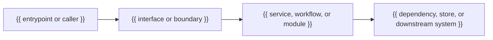

# Implementation Plan

## Source Context
- Story:
  - {{ story title or brief summary }}
- Story Source:
  - {{ link or path to the canonical story document }}
- Research Documents:
  - {{ link or path to a supporting research document }}
  - {{ link or path to a supporting research document }}
  - If none, write: `None`

## Goal
- {{ single actionable sentence describing the implementation goal }}

## Architecture Diagrams


| Boundary | Upstream | Downstream | Change intent |
| --- | --- | --- | --- |
| {{ boundary name }} | {{ upstream component }} | {{ downstream component }} | {{ what changes here }} |

## Symbol Skeletons

### Symbol: {{ Name }}
```text
Symbol type: {{ class | module | service | controller | workflow | function | repository | other }}
Purpose: {{ one-sentence responsibility }}
Depends on:
- {{ dependency or collaborator }}

Inputs:
- {{ input name }}: {{ description }}

Outputs:
- {{ output name }}: {{ description }}

Operations:
- {{ operation name }}: {{ what it does }}
- {{ operation name }}: {{ what it does }}
```
- Interaction notes: {{ callers, collaborators, downstream systems, and how data or control flows through the symbol }}

## Risk Assessment

| Risk category | Risk | Impact | Safeguard or planned mitigation | Validated by |
| --- | --- | --- | --- | --- |
| {{ technical | integration | data | permission | abuse/security | error-handling | performance | reliability | compatibility | accessibility/usability | operational | deployment/migration | dependency/supply-chain | regression/testability | delivery/scope | cost/commercial | compliance/audit }} | {{ concrete failure mode or concern }} | {{ likely delivery or release impact }} | {{ safeguard, mitigation, or plan element that addresses the risk }} | {{ applicable sub agents that validated this risk entry }} |

## Delivery Chunks

### Chunk {{ n }}: {{ Chunk name }}
- Status: `pending`
- Goal:
  - {{ measurable delivery increment this chunk completes }}
- Scope:
  - {{ capability, flow, or technical slice included in this chunk }}
- Dependencies:
  - {{ prerequisite chunk, dependency, or `None` }}
- Validation:
  - Manual user journeys:
    - {{ end-to-end browser or user workflow that proves this chunk is complete }}
    - If none, write: `None`
  - Integration tests:
    - {{ command, suite, or integration scenario that proves this chunk is complete }}
    - If none, write: `None`
  - Unit tests:
    - {{ focused unit-level command, suite, or scenario that proves this chunk is complete if the chunk is sufficiently small and narrow }}
    - If none, write: `None`
- Expected outcome:
  - {{ measurable result that indicates the chunk is complete }}

#### Task {{ n }}.{{ m }}: {{ Task name }}
- Status: `pending`
- Intent:
  - {{ what this task implements and why it matters to the chunk }}
- Steps:
  1. {{ first atomic action }}
  2. {{ next atomic action }}
- Files to change:
  - `{{ path/to/file.ext }}`: {{ modification }}
  - `{{ path/to/other-file.ext }}`: {{ modification }}
- Expected outcome:
  - {{ measurable result }}
  - {{ measurable result }}
- Review checkpoints:
  - {{ review lenses required for this task, such as correctness, simplicity, reuse, abstraction opportunity, naming, self-documentation, SOLID, or YAGNI }}
  - {{ what must be true for the task to clear review and proceed }}

## Final Operations

### Integration Testing
- Commands:
  - `{{ project-specific automated test command }}`
- Expected result:
  - {{ integration or automated scenarios that must pass }}

### Manual Testing
- Steps:
  1. {{ first manual verification scenario }}
  2. {{ next manual verification scenario }}
- Expected result:
  - {{ end-to-end behaviour that must be confirmed }}

## Open Questions
- {{ pointed actionable question }}
- {{ pointed actionable question }}
- If no additional input is needed, write:
  - None