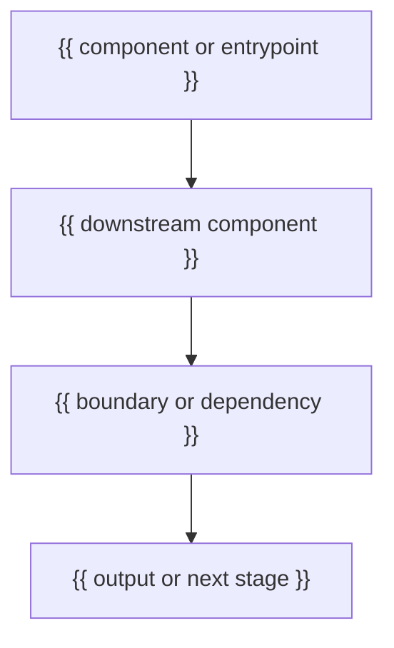

# {{TOPIC TITLE}}

## Quick Reference

| Area | Evidence | Key symbols | Verified by tests |
| --- | --- | --- | --- |
| {{ area }} | {{ file path(s) }} | {{ symbol names }} | {{ test file(s) }} |

| Symbol | File path | Purpose |
| --- | --- | --- |
| `{{ SymbolName }}` | `{{ path/to/file }}` | {{ concise purpose }} |

## Goals and Non-Goals

| Type | In scope | Out of scope |
| --- | --- | --- |
| {{ concern area }} | {{ what this document covers }} | {{ what this document explicitly excludes }} |

## Architecture



| Boundary | Upstream | Downstream | Evidence |
| --- | --- | --- | --- |
| {{ boundary name }} | {{ upstream component }} | {{ downstream component }} | {{ file path(s) }} |

| Major behaviour claim | Repository evidence | Test reference |
| --- | --- | --- |
| {{ behaviour claim }} | {{ file path(s) and symbol(s) }} | {{ test file(s) }} |

## Data and API Surface

| API surface | Type | Inputs | Outputs | Evidence |
| --- | --- | --- | --- | --- |
| `{{ symbol or contract }}` | {{ class/function/config/interface }} | {{ inputs }} | {{ outputs }} | {{ file path(s) }} |

## Behaviour Examples

| Input | Processing | Output | Evidence | Test reference |
| --- | --- | --- | --- | --- |
| {{ input or trigger }} | {{ processing flow }} | {{ output or effect }} | {{ file path(s) }} | {{ test file(s) }} |

```
// file: {{ path/to/file }}
{{ minimal real-code-shaped example tied to the topic }}
```

## Design Decisions

| Decision | Alternative | Rationale | Evidence | Test reference |
| --- | --- | --- | --- | --- |
| {{ chosen approach }} | {{ alternative considered }} | {{ why the chosen approach fits current evidence }} | {{ file path(s) }} | {{ test file(s) }} |

## Anti-Patterns

| Anti-pattern | Why it breaks the topic boundary | Evidence anchor |
| --- | --- | --- |
| {{ what to avoid }} | {{ concrete failure mode or drift risk }} | {{ file path(s) }} |