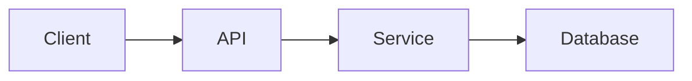

# Implementation Plan

## Source Context
- Story:
  - <story title or brief summary>
- Story Source:
  - <link or path to the canonical story document>
- Research Documents:
  - <link or path to supporting research document>
  - <link or path to supporting research document>
  - If none, write: `None`

## Goal
- Clearly state the implementation goal in a single, actionable sentence.

## Architecture Diagrams
- Include at least one ASCII or Mermaid diagram that shows the target architecture, components, boundaries, and data or control flow.
- Diagram example:


## Symbol Skeletons
- Provide lightweight, language-agnostic skeletons for the symbols that will be introduced or altered.
- Use these skeletons to describe intent, responsibilities, dependencies, inputs, outputs, and major operations without writing real implementation code.
- Prefer the most relevant symbol type for the work being planned, such as a class, module, service, controller, job, command handler, repository, workflow, or function.
- After each skeleton, describe how it interacts with surrounding components or infrastructure.

### Symbol: <Name>
```text
Symbol type: <class | module | service | controller | workflow | function | repository | other>
Purpose: <one-sentence responsibility>
Depends on:
- <dependency or collaborator>

Inputs:
- <input name>: <description>

Outputs:
- <output name>: <description>

Operations:
- <operation name>: <what it does>
- <operation name>: <what it does>
```
- Interaction notes: Describe which callers, collaborators, or downstream systems use this symbol and how data or control flows through it.

## Task List
- Each task must be a concrete operation referencing files and expected outcomes.
- Repeat the structure below for every major task in the plan.

### Task <n>: <Task name>
- Status: `pending`
- Intent:
  - Explain what this task will implement and why it matters.
- Steps:
  1. Describe the first atomic action needed.
  2. Describe the next atomic action, etc.
- Files to change:
  - `path/to/file.ext`: Explain the modification.
  - `path/to/other-file.ext`: Explain the modification.
- Expected outcome:
  - List measurable results that should be true after the task is completed.
- Review checkpoints:
  - List the review lenses required for this task, such as correctness, simplicity, reuse, abstraction opportunity, naming, self-documentation, SOLID, or YAGNI.
  - State what must be true for the task to clear review and proceed.

## Final Operations
- Always end with these sections in the following order.

### Integration Testing
- Commands:
  - `<project-specific automated test command>`
- Expected result:
  - Specify which integration/automated scenarios must pass.

### Manual Testing
- Steps:
  1. Describe the first manual verification scenario.
  2. Describe the next scenario, etc.
- Expected result:
  - Confirm the end-to-end behavior matches expectations.

## User Inputs Required
- If any information is still missing after reviewing the repo, ask pointed, actionable questions here.
- If no additional input is needed, write:
  - None